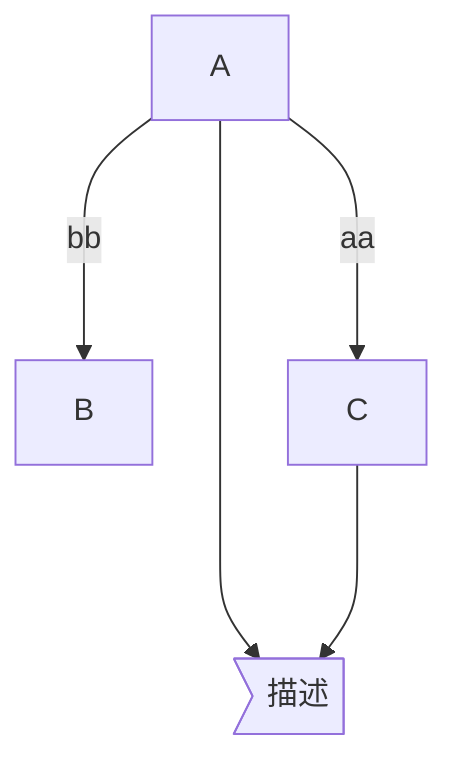
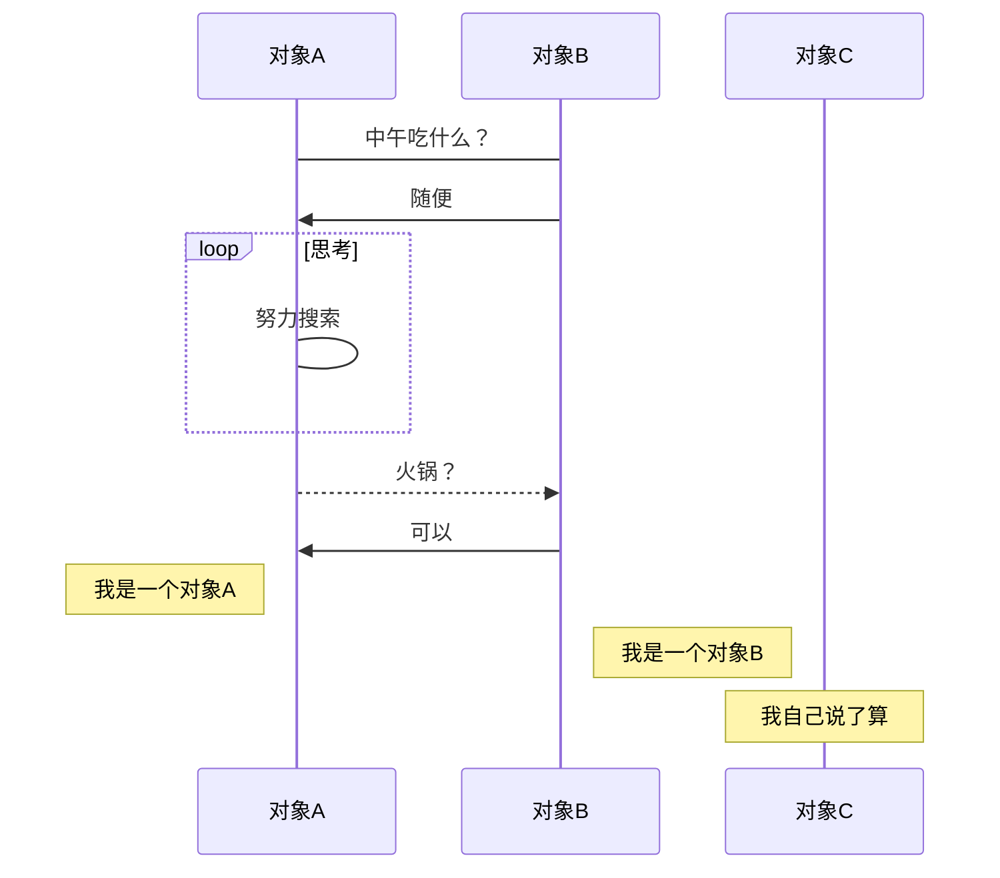
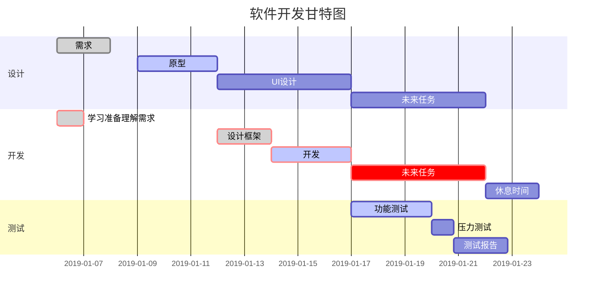
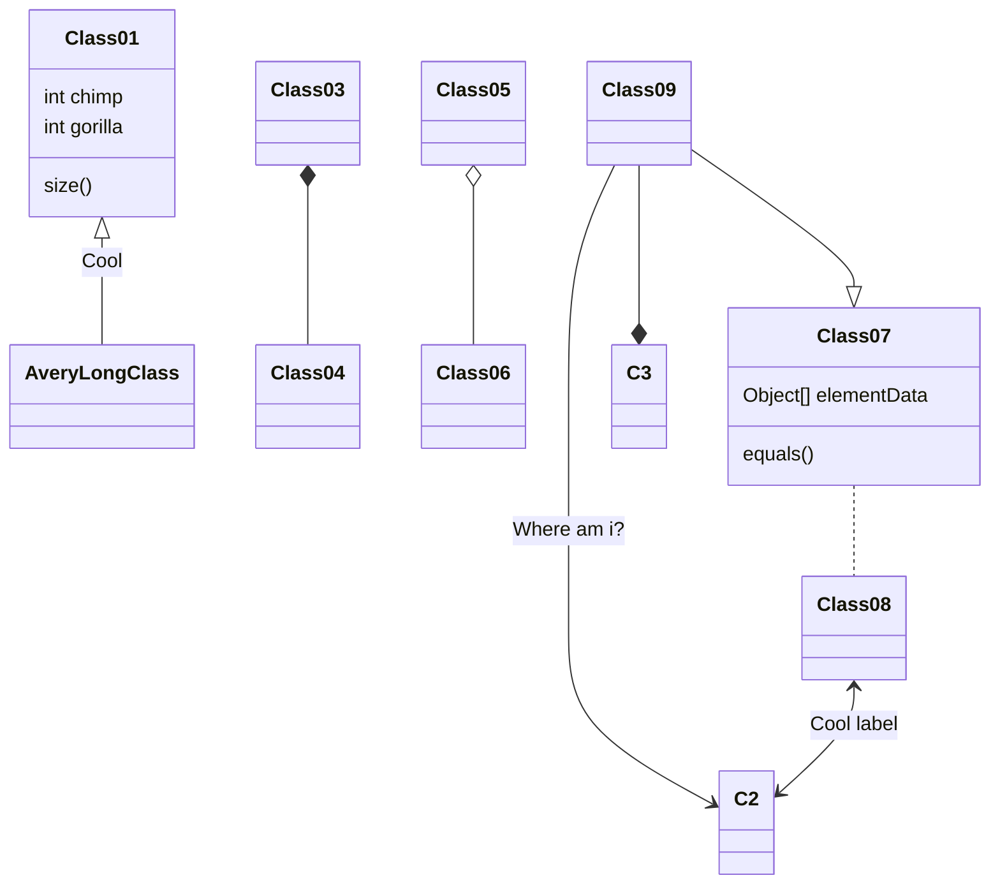
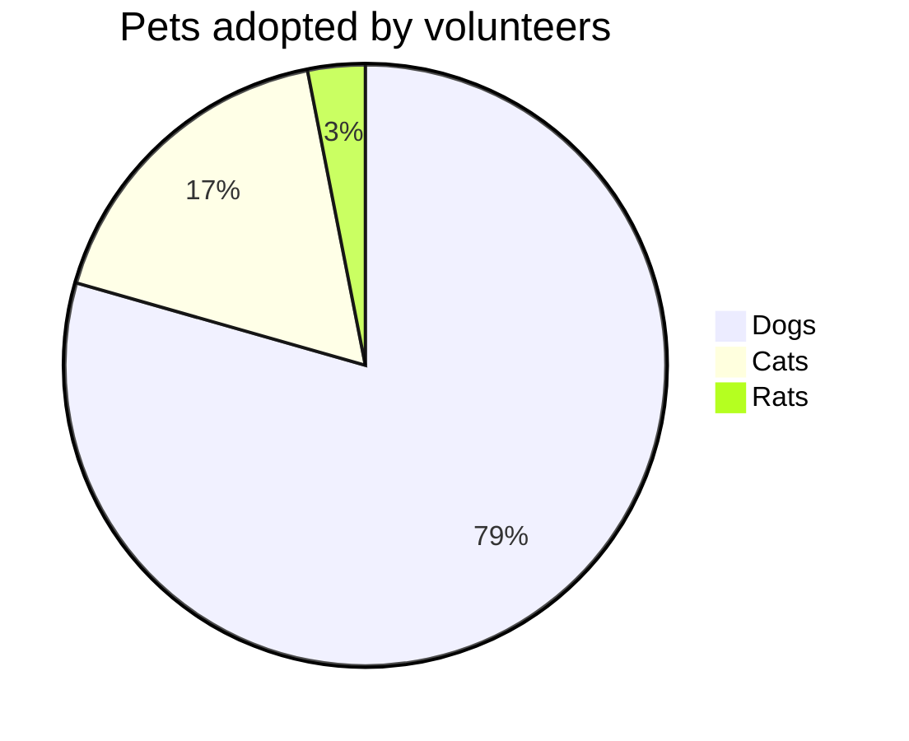

[toc]
Markdown学习
=
二级标题
--
# #号也可以表示一级标题
## 按照#号多少可以命名到六级标题
段落采用结尾两个及以上空格加回车  
这就是段落

也可以采用空一行的形式来形成段落
* _ ** __ *** ___ 
  
*斜体文本*  
_斜体文本_  
**粗体文本**  
__粗体文本__  
***粗斜体文本***  
___粗斜体文本___  

在一行中用三个以上的星号、减号、底线来建立一个分隔线，行内不能有其他东西。你也可以在星号或是减号中间插入空格
***
* * *
- - -

两端加~~~~为删除~~  
<u>下划线采用u标签</u>

创建脚注格式类似这样[^test].  
[^test]: 菜鸟教程 -- 学的不仅是技术，更是梦想！！！

* *无序列表  
+ +无序列表
- -无序列表

1. 有序列表
2. 有序列表
   
嵌套列表只需在子列表加4个空格
1. 列表
    + 列表

>使用>创建区块
>>使用多个>创建嵌套区块

`print()`函数片段使用反引号

    #使用一个tab或者4个空格创建代码块    
    print()

```javascript
// 使用三个反引号创建代码块，其后可以指定使用语言
console.log()
```

链接通过[]链接名称，()链接地址 [百度](http://www.baidu.com)

链接地址可换成[1]来替换， \[1\]: XXXXXX   [百度][1]

[1]: http://www.baidu.com

 也可以使用img标签

使用 | 分隔不同单元格 使用---- 分割其他行

:- 左对齐  :-:居中对齐   -: 右对齐

``` css
<style>
table th:first-of-type {
    width: 20%;
}
table th:nth-of-type(2) {
    width: 30%;
}
table th:nth-of-type(3) {
    width: 50%;
}
</style>
```

可以通过div包裹来控制列宽，也可以使用css来控制

|a|b|c|
|:-|:-:|-:|
|avalue|<div style="width:100px;">bvalue</div>|cvalue|

可以直接使用html标签  \<kbd>按键文本

数学公式采用两个\$\$包裹TeX的公式
$$2^3 \\ \angle A=90^ \circ$$

-[x] aaa  选项，兼容性一般


###流程图
* `graph`  指定流程图方向：`graph LR` 横向，`graph TD` 纵向
* 元素的形状定义：
    * `id[描述]` 以直角矩形绘制
    * `id(描述)` 以圆角矩形绘制
    * `id{描述}` 以菱形绘制
    * `id>描述]` 以不对称矩形绘制
    * `id((描述))` 以圆形绘制
* 线条定义：
    * `A-->B` 带箭头指向
    * `A---B` 不带箭头连接
    * `A-.-B` 虚线连接
    * `A-.->B` 虚线指向
    * `A==>B` 加粗箭头指向
    * `A--描述---B` 不带箭头指向并在线段中间添加描述
    * `A--描述-->B` 带描述的箭头指向  
    * `A-.描述.->B` 带描述的虚线连指向
    * `A==描述==>B` 带描述的加粗箭头指向
* 子流程图定义
```
subgraph title
    graph direction
end
```

### 标准流程图
* 定义模块 `id=>关键字: 描述` （“描述”的前面必须有空格，“=>” 两端不能有空格）
* 关键字：
    * `start` 流程开始，以圆角矩形绘制
    * `opearation` 操作，以直角矩形绘制
    * `condition` 判断，以菱形绘制 
    * `subroutine` 子流程，以左右带空白框的矩形绘制
    * `inputoutput` 输入输出，以平行四边形绘制
    * `end` 流程结束，以圆角矩形绘制
* 定义模块间的流向：
    * `模块1 id->模块2 id` ：一般的箭头指向  
    * `条件模块id (描述)->模块id(direction)` ：条件模块跳转到对应的执行模块，并指定对应分支的布局方向
```flow
graph TB
st=>start: 开始框
op=>operation: 处理框
cond=>condition: 判断框(是或否?)
sub1=>subroutine: 子流程
io=>inputoutput: 输入输出框
e=>end: 结束框
st(right)->op(right)->cond
cond(yes)->io(bottom)->e
cond(no)->sub1(right)->op
```
### 时序图
* 基本语法：
    * `Title:标题` ：指定时序图的标题
    * `Note direction of 对象:描述` ： 在对象的某一侧添加描述，direction 可以为 right/left/over ， 对象 可以是多个对象，以 , 作为分隔符
    * `participant 对象` ：创建一个对象
    * `loop...end` ：创建一个循环体
    * `对象A->对象B`:描述 ： 绘制A与B之间的对话，以实线连接
        * `->` 实线实心箭头指向
        * `-->` 虚线实心箭头指向
        * `->>` 实线小箭头指向
        * `-->>` 虚线小箭头指向

```sequence
Title:时序图示例
客户端->服务端: 我想找你拿下数据 SYN
服务端-->客户端: 我收到你的请求啦 ACK+SYN
客户端->>服务端: 我收到你的确认啦，我们开始通信吧 ACK
Note right of 服务端: 我是一个服务端
Note left of 客户端: 我是一个客户端
Note over 服务端,客户端: TCP 三次握手
participant 观察者
```
### 带样式时序图
* 需要使用 `mermaid` 解析，并在开头使用关键字 `sequenceDiagram` 指明
* 线段的样式遵循 mermaid 的解析方式
    * -> ： 实线连接
    * --> ：虚线连接
    * ->> ：实线箭头指向
    * -->> ：虚线箭头指向

### 甘特图
* 使用 `mermaid` 解析语言，在开头使用关键字 `gantt` 指明
* `deteFormat 格式` 指明日期的显示格式
* `title 标题` 设置图标的标题
* `section 描述` 定义纵向上的一个环节
* 定义步骤：每个步骤有两种状态 `done`（已完成）/ `active`（执行中）
    * `描述: 状态,id,开始日期,结束日期/持续时间`
    * `描述: 状态[,id],after id2,持续时间`
    * `crit` ：可用于标记该步骤需要被修正，将高亮显示
    * 如果不指定具体的开始时间或在某个步骤之后，将默认依次顺序排列


### 支持的图

> mermaid, PlantUML, WaveDrom, GraphViz，Vega & Vega-lite，Ditaa

```vega-lite
{
  "$schema": "https://vega.github.io/schema/vega-lite/v5.json",
  "description": "A simple bar chart with embedded data.",
  "data": {
    "values": [
      {"a": "A", "b": 28}, {"a": "B", "b": 55}, {"a": "C", "b": 43},
      {"a": "D", "b": 91}, {"a": "E", "b": 81}, {"a": "F", "b": 53},
      {"a": "G", "b": 19}, {"a": "H", "b": 87}, {"a": "I", "b": 52}
    ]
  },
  "mark": "bar",
  "encoding": {
    "x": {"field": "a", "type": "nominal", "axis": {"labelAngle": 0}},
    "y": {"field": "b", "type": "quantitative"}
  }
}
```



```mermaid
stateDiagram Start --> First First --> Second First --> Third Second --> End Third --> End state First { [*] --> fir fir --> [*] } state Second { [*] --> sec sec --> [*] } state Third {}
```



```ditaa{cmd=true args=["-E"]}
+---+
|   |
+---+
```

## code chunk